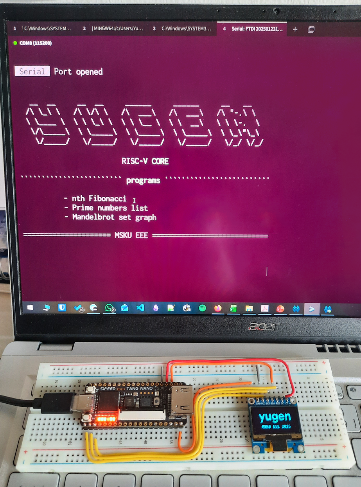
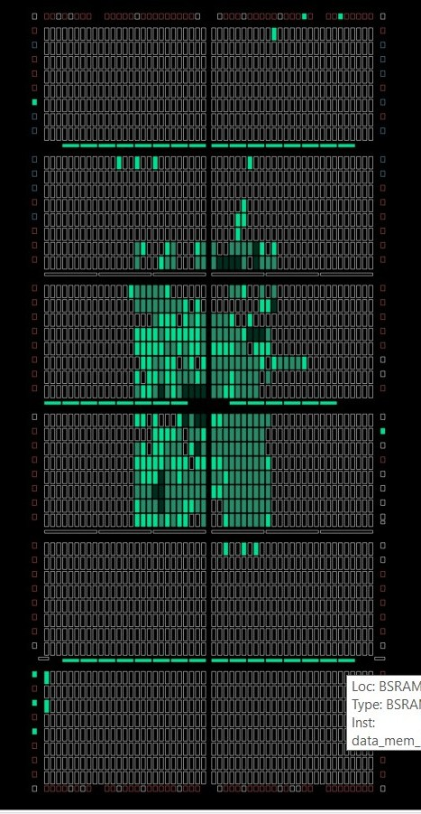

# yugen RV32I Processor

A simple implementation of a 32-bit pipelined RISC-V processor on an FPGA, written in SystemVerilog.

    

## Specifications
- RV32I: 32-bit base integer.
- classic 5-stage pipelined datapath
- Harvard memory organization
- Little-endian data format
- Memory-mapped on-board LED's UART and SPI I/O peripherals
- synthesized on Tang Nano 20k Gowin FPGA

<!--Organizational Structure -->

## Programs
Some programs written in RISC-V assembly and bare-metal C:

Mandelbrot set grapher in the terminal 

    

listing prime numbers upto 10,000

    

## Logisim

RV32IM variant simulation on logisim with some programs.

    

    
    
    

## Resource Utilization

|     | Total  | Used  | %   |
| --- | ------ | ----- | --- |
| LUT | 20,736 | 1,721 | 8   |
| FF  | 15,750 | 481   | 4   |
| BSRAM | 46   | 46    | 100 |

    

